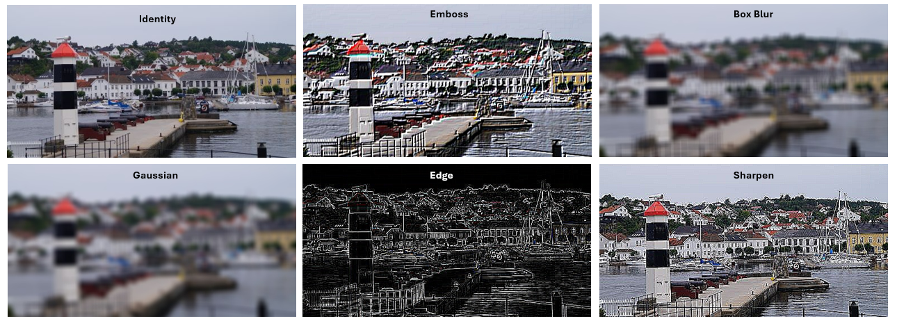

## Kernel Image Processing

Kernel-based image processing is a fundamental method in computer vision. It applies a small matrix of weights, called a **kernel** or **filter**, over an image using convolution. This operation recalculates each pixel based on its neighborhood, enabling various effects such as smoothing, sharpening, and feature enhancement.

This project implements both a **sequential CPU-based pipeline** and a **parallel GPU-based version using CUDA**. The goal is to compare their performance and demonstrate the benefits of GPU acceleration for high-resolution image processing.

### Filters Used

The following convolution filters were applied in both CPU and GPU versions:

- **Identity**: Leaves the image unchanged (baseline)
- **Box Blur**: Uniform smoothing by averaging neighboring pixels
- **Gaussian Blur**: Natural blur giving more weight to central pixels
- **Sharpen**: Enhances edges and contrast
- **Edge Detection**: Highlights contours and intensity transitions
- **Emboss**: Produces a 3D-like relief effect

### Visual Output

Below is a visual example showing the effect of each filter on the same input image:

